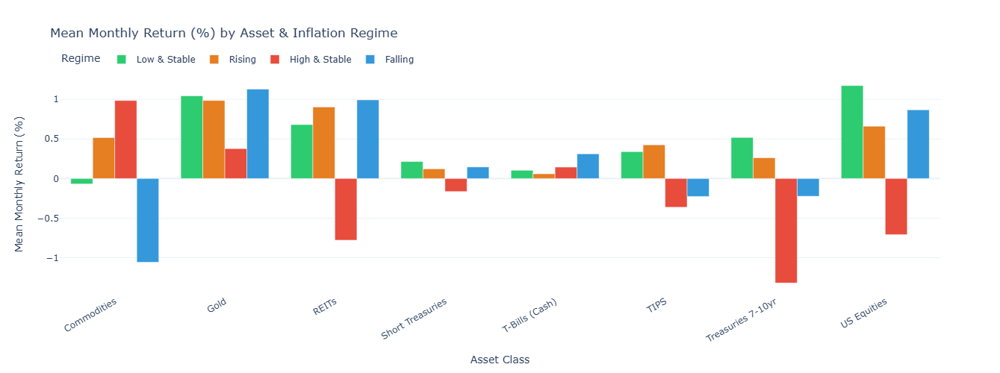
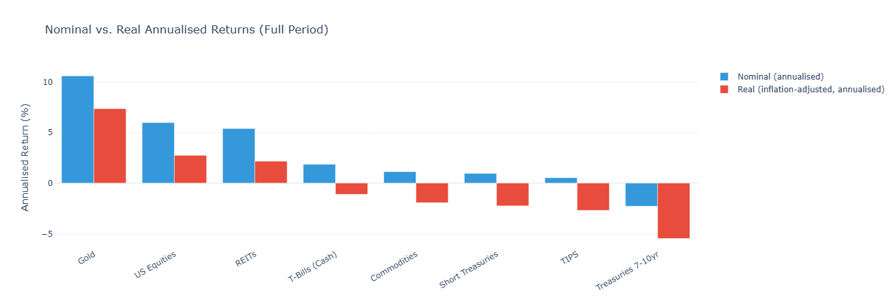
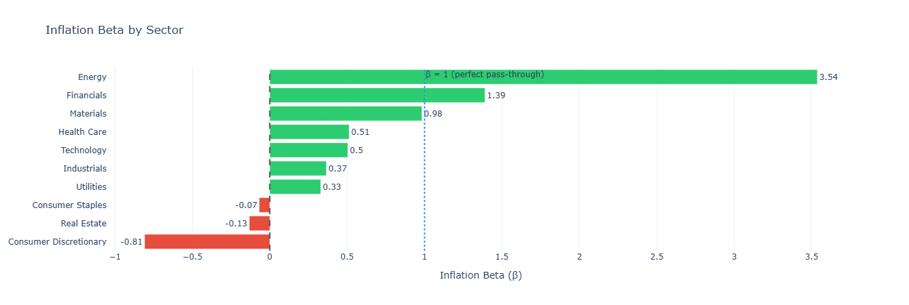

# Inflation Regimes & Market Returns

> Not all inflation is the same — and your hedge shouldn’t be either.

A quantitative macro study classifying 60+ years of U.S. inflation into four distinct regimes and evaluating how equities, bonds, gold, REITs, commodities, and TIPS perform within each environment — using both nominal and real (inflation-adjusted) returns.

---

## Key Findings

- Gold significantly outperforms primarily during **high & rising inflation regimes**, challenging its reputation as a universal hedge.
- Equities perform strongest in **low & falling inflation environments** but weaken during accelerating inflation phases.
- TIPS provide regime-specific protection rather than persistent outperformance.
- Sector-level inflation exposure varies materially, enabling selective hedging strategies.
- Inflation **direction (momentum)** matters as much as inflation level.

---

## Why This Matters

Traditional asset allocation assumes inflation behaves uniformly across cycles.

This research demonstrates that asset performance is **regime-dependent**, not static.

A regime-aware framework can support:

- Tactical asset allocation  
- Inflation hedging strategies  
- Sector rotation models  
- Macro-driven portfolio construction  
- Dynamic risk management  

---

## Inflation Regime Framework

Inflation is classified along two dimensions:

- **Level**
  - High: CPI > 4%
  - Low: CPI < 2.5%

- **Momentum**
  - Rising
  - Falling

This produces four macro regimes:

- Low & Stable  
- Rising  
- High & Stable  
- Falling  

### Inflation Regimes (1960–Present)

---

## Asset Performance by Regime

Mean monthly returns were calculated across major asset classes within each regime.

### Mean Monthly Return by Asset & Inflation Regime

### Observations

- Commodities and Gold outperform during inflation acceleration.
- US Equities show strongest performance in low & stable environments.
- Long-duration Treasuries struggle in rising inflation regimes.
- Return dispersion across regimes is economically meaningful.

---

## Nominal vs Real Performance

Inflation materially alters purchasing power outcomes.

### Nominal vs Real Annualised Returns

### Insight

Nominal bond returns significantly overstate real wealth preservation during inflationary environments, reinforcing the importance of inflation-adjusted analysis in portfolio construction.

---

## Sector-Level Inflation Sensitivity

Sector returns were regressed against inflation to estimate inflation beta:

R_sector = α + β × Inflation + ε

### Inflation Beta by Sector

### Key Observations

- Energy exhibits strong positive inflation beta.
- Materials and Financials show moderate positive sensitivity.
- Consumer Discretionary and Real Estate display negative inflation exposure.
- Defensive sectors cluster near neutral.

This suggests sector rotation can serve as a tactical inflation hedge.

---

## Methodology

- Threshold-based inflation regime classification (level + momentum)
- Regime validation using Hidden Markov Models (HMM)
- Monthly total return computation
- Real return adjustments via CPI
- Cross-asset and cross-sector comparative analysis

---

## Repository Structure
---

## Tools & Libraries

- Python  
- pandas  
- numpy  
- matplotlib  
- statsmodels  
- hmmlearn  

---

## Author

Siddhant Zade  
MS Finance  
Focused on macro-driven asset allocation & systematic research  
