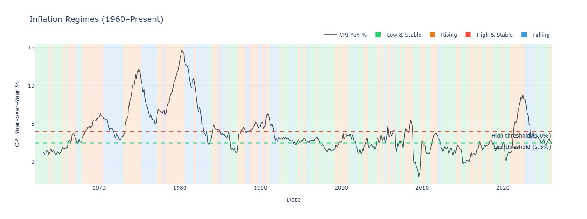

# Inflation Regimes & Market Returns


> Not all inflation is the same — and your hedge shouldn't be either.

A quantitative study classifying 60+ years of U.S. inflation into four distinct regimes and measuring how equities, bonds, gold, REITs, commodities, and TIPS perform within each regime — using both real (inflation-adjusted) returns and risk-adjusted metrics.

---

## Key Findings

- Gold significantly outperforms primarily during high-and-rising inflation regimes — challenging its reputation as a universal hedge.
- Equities perform strongly in low and falling inflation environments but struggle during accelerating regimes.
- TIPS and commodities provide regime-specific protection rather than persistent outperformance.
- Sector-level inflation exposure varies materially, enabling selective hedging strategies.
- Inflation direction (momentum) matters as much as inflation level.

---

## Why This Matters

Traditional asset allocation assumes inflation behaves uniformly across cycles.  
This research shows asset performance is regime-dependent.

A regime-aware framework can support:

- Tactical asset allocation  
- Inflation hedging strategies  
- Sector rotation models  
- Macro-driven portfolio construction  
- Dynamic risk management  

---

## Visual Summary

### Inflation Regime Timeline


### Asset Class Performance by Regime


### Sector Inflation Hedge Score


---

## The Four Inflation Regimes

| Regime | CPI Level | Momentum | Historical Example |
|--------|-----------|----------|-------------------|
| Low & Stable | < 2.5% | Flat | 2010–2020 |
| Rising | Any | Accelerating | 2021–2022 |
| High & Stable | > 4.0% | Flat | 1974–1975, 1980 |
| Falling | > 2.5% | Decelerating | 1982–1984, 2022–2023 |

Regime momentum (6-month change in CPI YoY) captures the direction of inflation, which often drives asset prices more than the absolute level.

---

## Methodology

### 1. Data

- Macro / inflation series — FRED API (1962–present): CPI, core CPI, PCE, Fed Funds Rate, yield curve, M2, breakeven inflation  
- Asset prices — Yahoo Finance via yfinance: SPY, IEF, TIP, GLD, VNQ, DJP, BIL  
- Sector prices — SPDR sector ETFs: XLE, XLK, XLF, XLU, XLI, XLB, XLP, XLY, XLV, XLRE  
- Monthly frequency throughout  
- Real returns computed via Fisher equation  

### 2. Regime Classification

Threshold-Based (Primary)  
Rule-based classifier using CPI level + 6-month momentum.  
Economically intuitive and interpretable.

Hidden Markov Model (Validation)  
GaussianHMM fitted on CPI YoY, 3-month annualised CPI, and real Fed Funds rate.  
Latent states sorted by CPI mean to match threshold labels.  
Agreement measured via Adjusted Rand Index.

### 3. Asset Class Analysis

- Mean & median monthly returns per regime  
- Annualised Sharpe ratios (regime-conditional)  
- Real (inflation-adjusted) returns  
- % positive months (reliability metric)  

### 4. Sector Hedge Analysis

- Rolling 24-month correlation (sector return vs CPI YoY)  
- Inflation beta via OLS regression  
- Composite hedge score: Sharpe + correlation + win-rate during high-inflation regimes  

---

## Project Structure

Inflation-Market-Study/
├── README.md  
├── requirements.txt  
├── analysis_colab.ipynb  
├── src/  
│   ├── __init__.py  
│   ├── data_fetch.py  
│   ├── regimes.py  
│   └── analysis.py  
└── data/  
    ├── raw/  
    └── processed/  

---

## Quickstart

### Option 1 — Run in Google Colab (Recommended)

Click below to open directly in Colab:

[](https://colab.research.google.com/github/SiddhantZade1/Inflation-Market-Study/blob/main/analysis_colab.ipynb)

No installation required.

### Option 2 — Run Locally

Clone repository:

git clone https://github.com/SiddhantZade1/Inflation-Market-Study.git  
cd Inflation-Market-Study  
pip install -r requirements.txt  

Set your FRED API key:

export FRED_API_KEY=your_key_here  

Run notebook:

jupyter lab analysis_colab.ipynb  

Data is fetched on first run and cached to data/raw/.

---

## Usage as a Library

```python
from src import DataFetcher, RegimeClassifier, AssetClassAnalysis, SectorHedgeAnalysis

fetcher = DataFetcher(fred_api_key="YOUR_KEY")
macro   = fetcher.get_macro()
master  = fetcher.get_master()

rc = RegimeClassifier(macro)
macro_regimes = rc.classify_threshold()
macro_hmm = rc.classify_hmm(n_states=4)

aca = AssetClassAnalysis(master.join(macro_regimes[['regime_label']]))
aca.plot_regime_returns(metric="sharpe")

sha = SectorHedgeAnalysis(master.join(macro_regimes[['regime_label']]))
sha.plot_hedge_scorecard()
